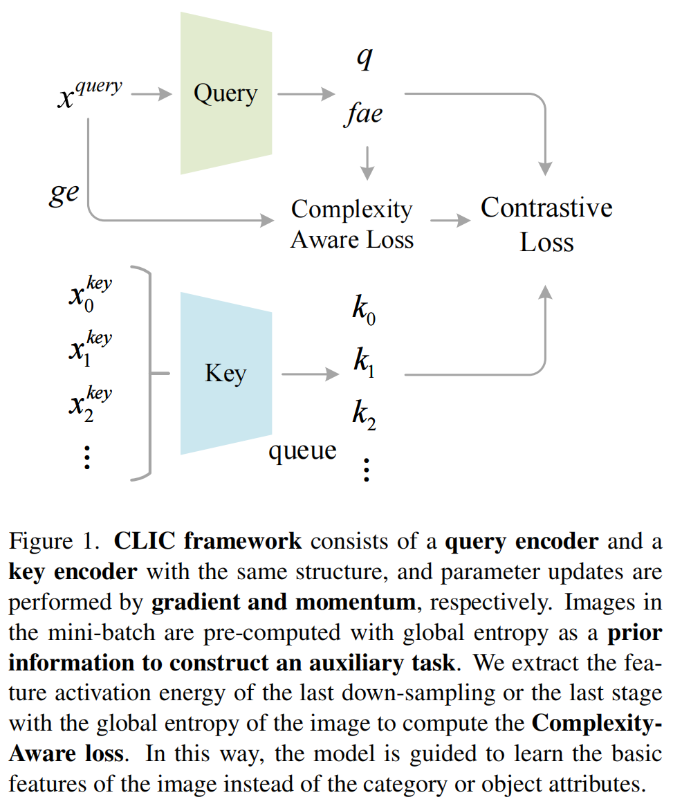
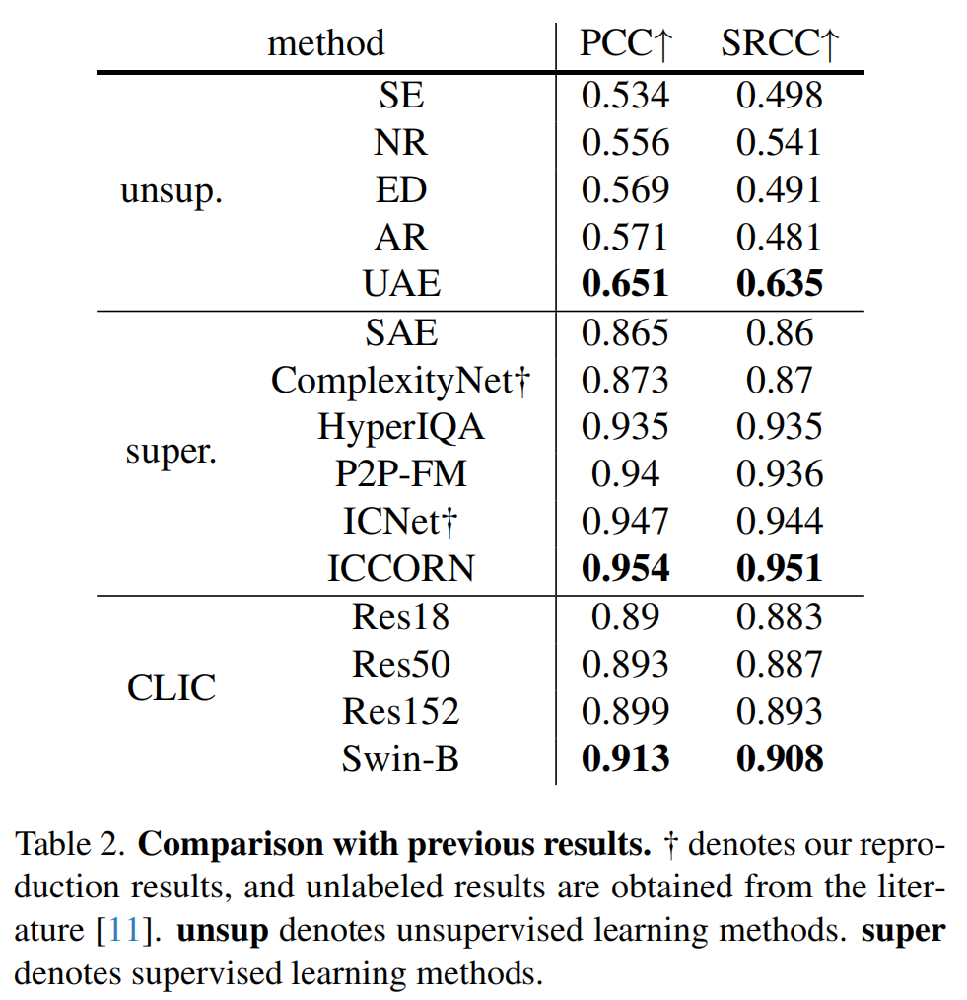
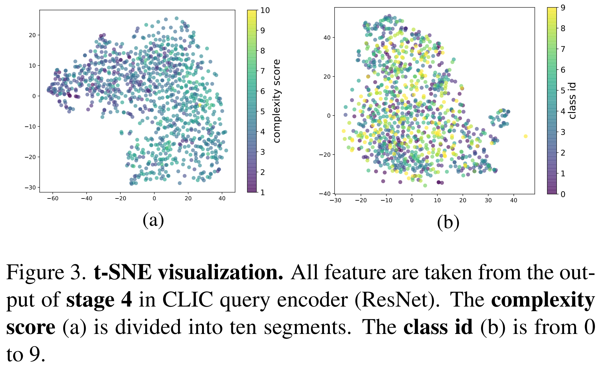
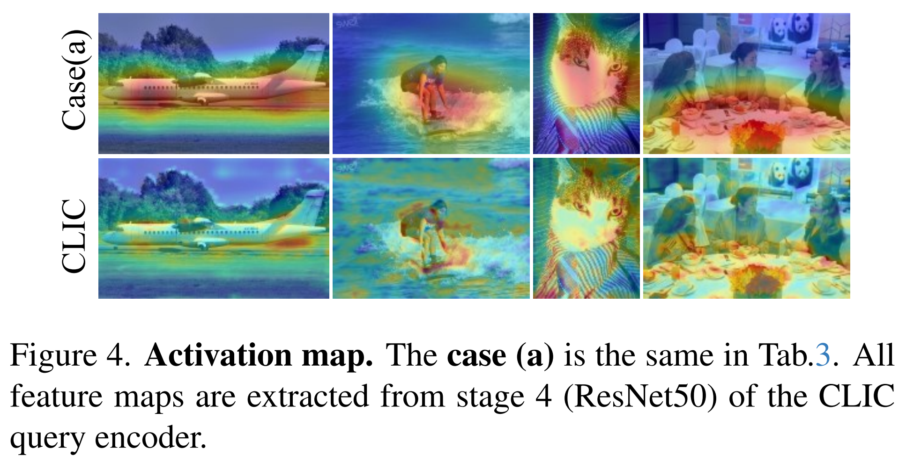

## Pytorch Implementation of CLIC.
#### The official code of our paper:
#### CLIC: Contrastive Learning Framework for Unsupervised Image Complexity Representation

- [ ] [arXiv](): preparing ...
- [ ] [project page](): preparing ...

#### CLIC Framework and Results
<p align="center">
    
</p>

<p align="center">
    
</p>


#### t-SNE Visualization and Activation Map
<p align="center">
    
</p>
<p align="center">
    
</p>


### 1. Installation

requirements: Note that the version is not required, just in our experiment.
```
python==3.7.6
torch==1.12.0+cu116
torchaudio==0.12.0+cu116
torchvision==0.13.0+cu116
```

### 2. Data Preparation

- [ ] data collection

dataset arch
```
dataset
    |—— images
        |- 001.jpg
        |- 002.jpg
```

### 3. Unsupervised Training

To do unsupervised pre-training of a ResNet-50 model in an 4-gpu machine, run:
```
python train.py \
  -a resnet50 \
  --lr 0.03 \
  --batch-size 128 \
  --dist-url 'tcp://localhost:10001' --multiprocessing-distributed --world-size 1 --rank 0 \
  [your imagenet-folder with train and val folders]
```

### 4. Fine-tuning

To do unsupervised pre-training of a ResNet-50 model on ImageNet in an 8-gpu machine, run:
```
python fine_tuning.py
```

### Acknowledgment
* [MoCo](https://github.com/facebookresearch/moco): Official PyTorch implementation of the MoCo.
* [ICNet&IC9600](https://github.com/tinglyfeng/IC9600):IC9600: A Benchmark Dataset for Automatic Image Complexity Assessment.
* [ImageNet](https://image-net.org/):ImageNet: An large-scale image dataset.
* [Flickr-5B](https://huggingface.co/datasets/bigdata-pw/Flickr):Flickr: Approximately 5 billion images from Flickr.
